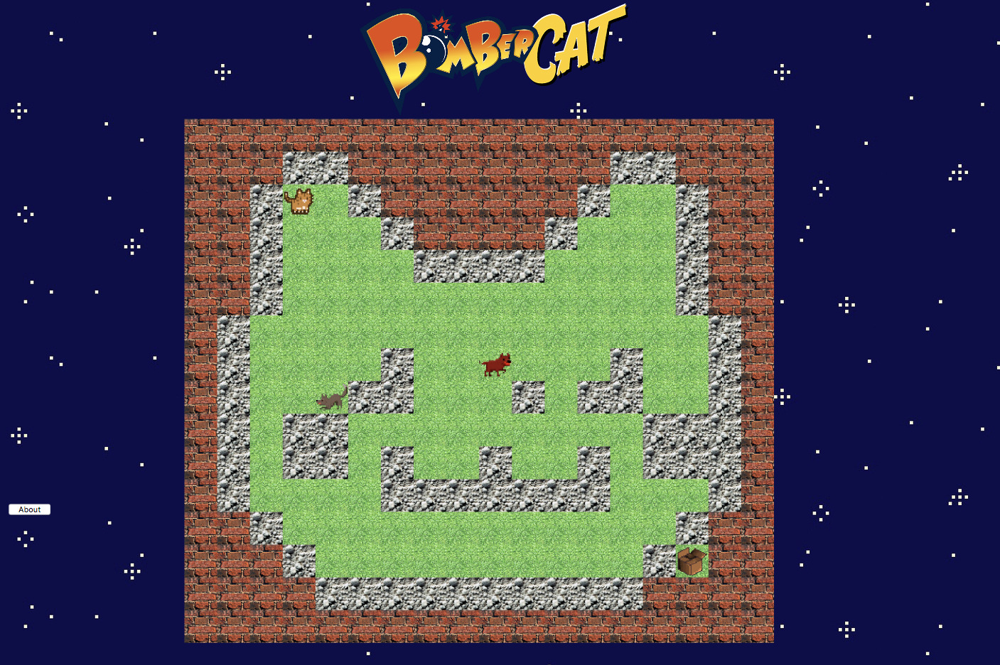

# Bombercat

Week 9 project at Makers Academy. Building Bomberman arcade game in JavaScript.

Project team: [Ben](https://github.com/BenChallenor), [Justyna](https://github.com/Kotauror), [Laura](www.github.com/lwkchan), [Noel](https://github.com/noel1uk) and [Steve](https://github.com/stilley85)

In sum: a game with a cat which moves around a map and drops bombs to get to the other side.

## How to use

We have deployed the game on http://bombercat.surge.sh/.

The aim of the game is to get to the box!
* Drop bombs with the spacebar to blow up blocks of cat litter.
* Move around with the arrow keys

### To test

* Clone this repo and open SpecRunner.html in your web browser

## User stories

```
As a user
So I can have some fun
I would like to play bombercat

As a user
So I can complete the game
I would like to have a winning condition

As a user
So I can have excitement in the game
I would like to have losing conditions
```

## Our approach

1. First we researched what language we would use to build the game. Having read up on Pygame, CreateJS and Vanilla JavaScript (as well as spiking some code in these languages), we chose CreateJS as it was easy to implement animations with the library.

2. We split off our game into features that we wanted to have, namely
* The map
* The cat (player)
* Bombs and explosions
* Dogs and wolfs
* The end goal (the box)

3. From this, we learned to implement each component with CreateJS

4. One of our biggest challenges was working out how to test the code. We ended up doing this by encapsulating each part and testing these as we went along

## Screenshot



## Key learnings

* Learning a new JavaScript library (CreateJS) and how to test it
* Working effectively as a team - sticking to goals, delegating tasks efficiently
* How to encapsulate code so that it was easily extensible
